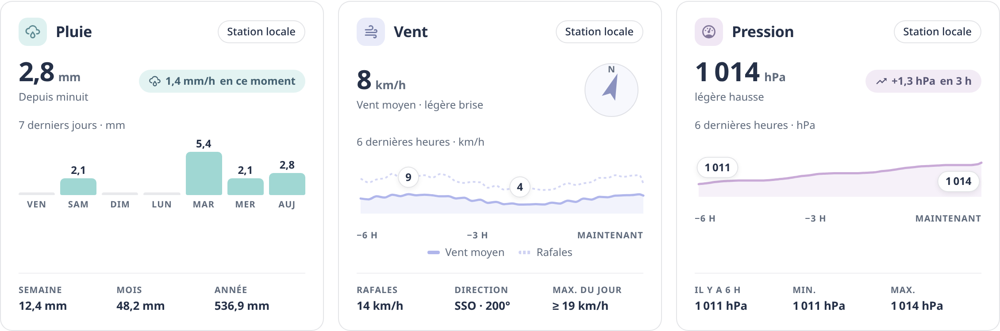

# Niak Weather

**La météo chez vous, expliquée et mise en perspective.** Niak Weather rassemble les prévisions de votre commune et, si vous le souhaitez, les mesures d’une station locale, le ressenti, la qualité de l’air et les pollens. La carte lit les intégrations déjà configurées dans Home Assistant : elle ne nécessite pas que vous ajoutiez toutes ces sources.

Pour commencer, il faut seulement Home Assistant **2025.1 ou plus récent** et une entité météo `weather.*`. **Météo-France est la source recommandée**, mais une autre intégration météo peut convenir si elle fournit les prévisions utilisées par la carte. Les autres sources sont des enrichissements, pas des prérequis.


Illustration de présentation avec des données d’exemple ; le rendu réel du bandeau dépend de votre météo, de vos capteurs et du thème Home Assistant.

## Les sources : du minimum aux enrichissements

| Source | Statut | Ce qu’elle apporte |
| --- | --- | --- |
| Entité météo `weather.*` | **Obligatoire** | Conditions et prévisions de votre zone. Météo-France est recommandée ; les données disponibles dépendent du fournisseur. |
| Capteurs locaux / station météo | **Conseillée** | Mesures prises chez vous : température, pluie, vent et pression. Profils guidés GW2000A et WS90 via Zigbee2MQTT, ou sélection manuelle. Chaque capteur se configure séparément : vous n’avez pas besoin de tous les instruments. |
| Thermal Comfort | **Conseillé pour un ressenti tenant compte de l’humidité** | Humidex extérieur. Sans lui, la carte peut encore estimer le ressenti à partir de la température, mais indique que l’humidité n’est pas comptée. |
| Soleil (`sun.sun`) | **Conseillé**, généralement déjà présent | Lever, coucher et position du soleil. L’effet du rayonnement sur le ressenti demande aussi un capteur de rayonnement solaire local. |
| Atmo France | Facultative | Indices d’air extérieur et de pollens pour aujourd’hui et demain, selon les données activées dans l’intégration. |
| Historique Home Assistant (Recorder) | Facultatif | Tendances de pression et de vent ; peut compléter certains bilans de pluie lorsque la station ne fournit pas les compteurs nécessaires. |
| Polleninformation EU | Facultatif, alternative à Atmo pour les pollens | Conserve les pollens d’une installation existante. Atmo apporte en plus les indices de qualité de l’air. |

**En pratique :** l’entité météo seule suffit pour afficher la carte et ses prévisions. Ajoutez une station pour suivre les observations chez vous, Thermal Comfort pour enrichir le ressenti, et Atmo France si vous souhaitez les informations sur l’air et les pollens. La carte indique la source de chaque valeur et distingue toujours une prévision d’une mesure réelle. [Détails des sources et de leurs limites](docs/sources.md).

**Version stable : v1.9.0.** L’éditeur propose les profils de station et le mode manuel, puis organise les capteurs par mesure. [Nouveautés de la version 1.9.0](docs/release-1.9.0.md) · [Installation et mise à jour](docs/installation.md).

[](https://my.home-assistant.io/redirect/hacs_repository/?owner=Niakman13&repository=niak-weather&category=plugin)


Illustration de présentation avec des données d’exemple ; le rendu réel du bandeau dépend de votre météo, de vos capteurs et du thème Home Assistant.
[Installation et mise à jour](docs/installation.md) · [Sources et prérequis](docs/sources.md) · [Atmo France : air et pollens](docs/atmo-france.md) · [Tous les réglages](docs/data-model.md) · [Comprendre le brief](docs/brief-intelligent.md)


Aperçus réalisés avec des données de démonstration dans le navigateur de test. La carte suit le thème Home Assistant ; les sources et valeurs illustrées peuvent différer de votre installation.

## Ce que la carte apporte

La carte s’organise en trois temps : **maintenant**, **ensuite** et **les relevés**. La synthèse du bandeau attire l’attention sur une alerte ou un changement utile ; si rien ne ressort, elle ne remplit pas l’espace avec un message banal. Le ciel animé montre les conditions actuelles fournies par la météo. Les mesures de la station restent des observations locales et les prévisions gardent leur source météo.

Dans **Aujourd’hui**, la jauge explique l’écart entre le ressenti estimé et le thermomètre. Trois colonnes de même hauteur regroupent **Pluie**, **Vent** et **Pression**. Le vent réunit vitesse, rafales et rose des directions ; la pression montre sa valeur et son évolution. Les cadres indiquent d’où vient chaque lecture et gardent leurs graphiques dans **Statistiques**, replié au départ. La pluie rassemble les cumuls disponibles et leur historique.


Quand Atmo France est configuré, **Air extérieur** et **Pollens** sont présentés dans deux cadres distincts, avec une source et des cercles colorés. Les données du jour et les prévisions de demain restent distinctes ; les détails des polluants et des espèces de pollens sont repliés. [Sources des graphiques et limites](docs/recent-details.md).

Dans **Prévisions**, deux cadres séparent la courbe des prochaines heures du tableau de la semaine. Les unités **Min °C**, **Max °C** et **Pluie mm** sont rappelées en tête du tableau. Les statistiques historiques des capteurs locaux ne se confondent pas avec ces prévisions. [Sources des graphiques et limites](docs/recent-details.md).

Le rendu s’adapte à la largeur disponible et au thème Home Assistant. Les colonnes se réorganisent sur mobile et les interrupteurs des sections permettent de choisir les informations affichées, sans mode compact séparé.

Les sections Synthèse / météo actuelle, Aujourd’hui et Prévisions peuvent être activées séparément. Sans station, les cadres s’appuient sur les données météo disponibles et indiquent leur source. Si un capteur local configuré devient indisponible et que la météo fournit une valeur de remplacement, ce repli est signalé. La jauge du ressenti n’apparaît que si elle dispose d’une température locale ou d’un humidex utilisable. [Affichage et priorité des sources](docs/display-options.md).

Les prévisions affichent jusqu’à **18 heures et 7 jours**, selon les données réellement fournies. La carte distingue les conditions prévues pour la zone des mesures prises chez vous. Une mesure de station indisponible n’est pas remplacée par un zéro, et un orage prévu n’est pas présenté comme de la foudre détectée par la station.

Dans l’éditeur, choisissez **GW2000A**, **WS90 via Zigbee2MQTT** ou **Autre station / configuration manuelle**. Les champs adaptés apparaissent par catégories simples ; le préremplissage est proposé pour chaque source. Les choix manuels sont filtrés par fonction, et les sélections ambiguës restent à confirmer. [Guide des sources](docs/sources.md) · [Installation](docs/installation.md).

## Comment la carte interprète la météo

### Observer chez vous, prévoir pour votre zone

Météo-France fournit les conditions et prévisions de votre commune. Ecowitt apporte les observations à la maison. Pour l’état actuel, une pluie mesurée, des conditions compatibles avec un brouillard dense ou un fort rayonnement solaire peuvent prendre le pas sur le bulletin de la zone. **Cela ajuste la présentation du temps actuel, pas les prévisions du fournisseur.**

### Expliquer le ressenti

Le calcul part de l’**humidex extérieur** de Thermal Comfort, ou du thermomètre si l’humidex manque. Il ajoute les contributions estimées du vent, du rayonnement solaire, de la pluie et du ciel nocturne lorsque leurs données sont disponibles. La carte affiche le résultat, l’écart avec le thermomètre et les contributions, pour comprendre pourquoi l’atmosphère paraît plus chaude ou plus froide. Sans humidex, elle précise que l’humidité n’est pas comptée.

> **Comment lire le ressenti ?** C’est une estimation de l’ambiance extérieure propre à Niak Weather, pas un indice météorologique officiel ni une mesure physiologique. La base est l’humidex fourni par Thermal Comfort (température et humidité déjà combinées), ou la température réelle si cet humidex manque. La carte y ajoute les effets estimés du vent, du soleil, de la pluie et d’une nuit claire. Le petit « i » à côté de Ressenti rappelle ce principe et renvoie à cette explication.

**Formule : ressenti = humidex (ou température) + vent + soleil + pluie + nuit.** L’humidité n’est pas ajoutée une seconde fois à l’humidex. Les corrections dont les données nécessaires manquent restent nulles. Chaque correction et le résultat final sont arrondis au dixième.

| Effet | Règle utilisée |
| --- | --- |
| Vent | Vent effectif = maximum entre zéro et 75 % du vent moyen + 25 % du maximum entre vent moyen et rafale − 3 km/h, arrondi au dixième. Correction de −0,25 °C par km/h, ou −0,15 lorsque la base dépasse 27 °C. Au-dessus de 32 °C réels, transition progressive sur 3 °C vers un coefficient dépendant de l’humidité, compris entre −0,08 et +0,06. Correction totale limitée entre −6 et +1,5 °C. |
| Soleil | Si l’élévation solaire dépasse 5° et le rayonnement mesuré dépasse 50 W/m² : rayonnement ÷ 300, arrondi au dixième, jusqu’à +3,5 °C. Les UV et la luminosité ne remplacent pas le rayonnement. |
| Pluie | À partir de 0,3 mm/h mesurés : −1,5 × min(intensité ÷ 2, 1) × (1 + min(vent effectif, 30) ÷ 60), jusqu’à −2,25 °C avant arrondi. |
| Nuit | Si l’élévation solaire est au plus −3° et la couverture nuageuse inférieure à 40 % : −1 × (1 − couverture ÷ 40), jusqu’à −1 °C. |

Par exemple : un humidex de **29 °C**, un effet du vent de **−0,4 °C** et du soleil de **+1 °C**, sans autre correction, donnent **29,6 °C ressentis**. La pression, les UV, la pollution et les pollens ne sont pas additionnés à ce chiffre ; ils peuvent en revanche enrichir la synthèse.

Ces coefficients sont des règles d’estimation de la carte, pas une formule standard validée. La carte ne connaît pas vos vêtements, votre activité ni votre exposition réelle : l’effet solaire représente une ambiance exposée, pas forcément le ressenti à l’ombre. En configuration météo seule, sans température locale ni humidex utilisable, la jauge est masquée. [Calcul détaillé dans le code](src/weather-model.ts).

### Anticiper les prochaines heures et les prochains jours

La carte demande séparément les prévisions horaires et quotidiennes à votre entité météo, avec un renouvellement toutes les 15 minutes pendant qu’elle est affichée. Elle montre jusqu’à 18 points horaires et 7 jours, selon le fournisseur. La courbe représente les **températures prévues**, et non le ressenti calculé de la station ; elle comporte les extrema, les repères horaires, les périodes nocturnes et les précipitations annoncées. Les plages quotidiennes utilisent une échelle commune pour comparer les minimums et maximums d’un jour à l’autre.

La lecture horaire alimente aussi des phrases de synthèse : première pluie annoncée, accalmie pendant un épisode pluvieux, cumul attendu sur les prochaines heures ou orage prévu à court terme. Ces indications sont des interprétations des données reçues, pas de nouvelles prévisions ni une garantie d’heure exacte. **Niak Weather n’est pas un modèle de prévision météorologique indépendant.**

### Mettre les mesures en perspective

L’historique Home Assistant permet de qualifier l’évolution de la pression et du vent. Les compteurs de la station mettent la pluie du jour en perspective avec la semaine, le mois et l’année. Atmo France complète cette lecture avec ses indices quotidiens de zone et, si disponibles, ceux de demain. [Mécanique et réglages détaillés](docs/data-model.md).

**Aucun `button-card`, chart-card, card-mod ou package de templates supplémentaire n’est nécessaire.** Node.js et les outils de développement ne sont pas requis chez les utilisateurs. Niak Weather ne configure pas les intégrations à votre place et ne demande aucun identifiant Atmo dans ses réglages.

## Installer avec HACS

1. Ouvrez le bouton HACS en haut de cette page. Il ouvre le dépôt, sans installer automatiquement la carte.
2. Si le dépôt n’est pas trouvé, ajoutez `https://github.com/Niakman13/niak-weather` dans **HACS → ⋮ → Dépôts personnalisés**, catégorie **Tableau de bord / Dashboard**. Il s’agit d’un dépôt personnalisé, pas d’un référencement dans le catalogue HACS par défaut.
3. Téléchargez **Niak Weather v1.9.0**, puis rechargez le navigateur.
4. Dans votre tableau de bord, choisissez **Ajouter une carte → Niak Weather** et sélectionnez votre entité météo.
5. Ajoutez si souhaité les sources **Station météo locale**, **Thermal Comfort** et **Atmo France**. Utilisez **Remplir automatiquement** dans chaque catégorie, puis vérifiez les propositions avant d’enregistrer. Sans station, les cadres utilisent les attributs du bulletin disponibles, avec une bulle de source ; la pluie prévue reste distinguée de la pluie mesurée.

Configuration minimale, sans station :

```yaml
type: custom:niak-weather-card
weather_entity: weather.ma_commune
```

Exemple enrichi avec des mesures locales et l’humidex :

```yaml
type: custom:niak-weather-card
weather_entity: weather.ma_commune
temperature_entity: sensor.station_outdoor_temperature
humidity_entity: sensor.station_outdoor_humidity
humidex_entity: sensor.exterieur_humidex
wind_speed_entity: sensor.station_wind_speed
rain_rate_entity: sensor.station_rain_rate
daily_rain_entity: sensor.station_daily_rain
```

Ces identifiants sont des **exemples**, pas des noms imposés. Privilégiez vos entités réelles dans l’éditeur. Le [tutoriel d’installation](docs/installation.md) détaille les ressources, les réglages et le dépannage.

## Mettre à jour vers v1.9.0

Dans **HACS → Niak Weather**, utilisez **Mettre à jour** ou **⋮ → Retélécharger** et sélectionnez **v1.9.0**. Il n’est pas nécessaire d’activer les préversions. Rechargez ensuite le navigateur avec **Ctrl+F5** ; sur mobile, videz le cache frontend si l’ancienne version reste affichée.

Les mises à jour utilisent la même ressource et conservent vos entités. Les anciens modes sont convertis en réglages de sections : les prévisions d’une ancienne configuration compacte restent masquées sauf choix explicite contraire. Vous pouvez enrichir la configuration progressivement, sans recommencer l’installation. [Notes de version](docs/release-1.4.0.md).

## Limites et transparence

Le ressenti est une **estimation locale**, pas une mesure physiologique ni une vigilance officielle. Sans humidex, la carte signale que l’humidité n’est pas comptée. Les données Atmo décrivent la zone et ne remplacent pas un capteur dans le jardin. Les indices et concentrations Atmo ne sont pas mélangés.

La carte n’effectue pas de détection de foudre et ne pilote pas vos ouvrants. Les orages du ciel animé viennent de l’état actuel du fournisseur météo ; ceux du brief peuvent être annoncés par les prévisions. Ce ne sont pas des éclairs détectés sur place. Ses indicateurs ne remplacent ni la vigilance officielle ni les alertes de sécurité. Les calculs dans le navigateur ne créent pas d’entités Home Assistant pour les automatisations.

## Développement et vérifications

```sh
npm ci
npm run validate
npx playwright install chromium
npm run test:browser
```

`npm run build` produit `dist/niak-weather-card.js`. Les releases GitHub vérifient le code et le rendu, puis joignent le fichier installable et sa carte de sources. Les utilisateurs reçoivent les mises à jour par HACS sans compilation.

Les tests couvrent le ressenti, les conditions observées, les prévisions, les données manquantes, le préremplissage et les interactions. Des contrôles visuels à 375, 768 et 1440 px en clair/sombre détectent les régressions du rendu et les débordements. Ils utilisent des composants hôtes Home Assistant simulés : ils ne garantissent pas tous les thèmes tiers ni la disponibilité des capteurs de chaque installation. [Vérifications et limites](docs/parity.md).

Licence MIT — [LICENSE](LICENSE).
