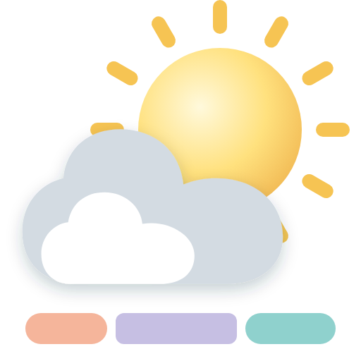
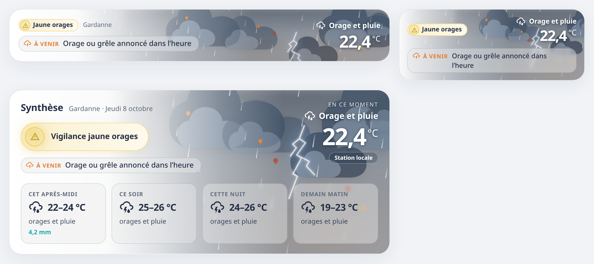
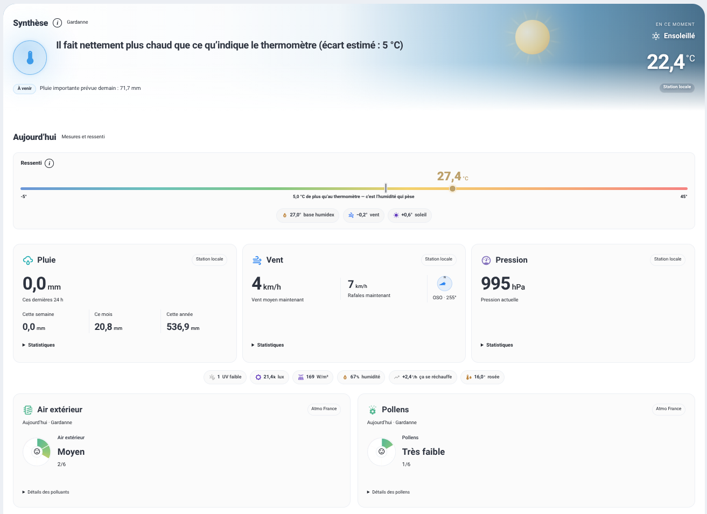

# Niak Weather

[](https://github.com/Niakman13/niak-weather/releases)
[](https://github.com/Niakman13/niak-weather/actions/workflows/validate.yml)
[](https://hacs.xyz)
[](LICENSE)

[](https://github.com/sponsors/Niakman13)
[](https://www.buymeacoffee.com/frankblemont)
[](https://paypal.me/frankblemont)



**La météo chez vous, en une carte qui parle.** La carte Niak Weather affiche ce que calcule [l’intégration Niak Weather](https://github.com/Niakman13/niak-weather-integration) : la vigilance, le bulletin du jour, les alertes à leur heure, le ressenti, la pluie, le vent, la pression, l’air et les pollens, sur un ciel animé.


## Ce qu’il faut

- Home Assistant **2025.1** ou plus récent.
- **[L’intégration Niak Weather](https://github.com/Niakman13/niak-weather-integration)** : elle lit vos sources (Météo-France, station, vigilance, Atmo France) et fait tous les calculs. La carte ne fait qu’afficher.

Les explications (ressenti, alertes, bulletin, sources) sont dans [la documentation de l’intégration](https://github.com/Niakman13/niak-weather-integration#documentation).

## Installer

1. Installez et configurez [l’intégration Niak Weather](https://github.com/Niakman13/niak-weather-integration#installation).
2. Dans HACS, ouvrez le bouton ci-dessous (ou ⋮ → **Dépôts personnalisés** : `https://github.com/Niakman13/niak-weather`, catégorie **Tableau de bord**), téléchargez **Niak Weather**, puis rechargez le navigateur (**Ctrl+F5**).
3. Sur un tableau de bord : **Ajouter une carte → Niak Weather**.

[](https://my.home-assistant.io/redirect/hacs_repository/?owner=Niakman13&repository=niak-weather&category=plugin)

Vous aviez la version 1.20 ? [Passer à la 2.0](docs/migration.md) : l’intégration reprend les réglages de vos cartes.

## Trois formats

| Format | Pour quoi |
| --- | --- |
| **Tuile** (`tile`) | La page d’accueil, en pleine ou demi-largeur : le lieu, la vigilance, la bulle qui défile et la météo du moment. **Un appui** la déplie sur place (bulletin et frise), **un appui long** ouvre la carte complète par-dessus la page. |
| **Tuile dépliée** (`intermediate`) | La même tuile, ouverte au départ. |
| **Complète** (`full`, par défaut) | Une page météo : le bandeau, puis **Aujourd’hui** et **Prévisions**, qui se replient d’un appui sur leur titre. |



## Le bandeau

- **La vigilance officielle**, quand il y en a une : une pastille compacte, l’icône du phénomène dans un disque de la couleur du niveau, avec un halo.
- **Le bulletin du jour**, en entier.
- **La frise des heures à venir**, dans un verre dépoli :
  - une phrase qui défile parcourt les points un à un ;
  - chaque point est une étiquette à son heure ; ceux du moment sont réunis dans « Maintenant » ;
  - l’alerte mesurée chez vous ouvre cette étiquette, avec son halo ;
  - la piste suit le ciel prévu, et une vigilance l’entoure d’un anneau lumineux.

  Un appui sur une étiquette affiche son point ; le défilement se met en pause au survol.
- **La météo du moment** à droite : ciel, température, tendance, source.

Derrière, **le ciel animé** suit le temps du moment :

- soleil à rayons, lune à cratères, nuages, orages avec éclairs, rafales ;
- la neige tombe et tient au sol, la grêle rebondit, la pluie éclabousse ;
- les saisons s’y glissent : pétales, chaleur, feuilles rousses, givre.



## Aujourd’hui et Prévisions

- **Aujourd’hui** : le ressenti et ce qui le fait monter ou baisser (un **i** détaille le calcul), puis Pluie, Vent et Pression, chacun avec sa valeur, un petit graphique et trois chiffres utiles. Ensuite, l’air extérieur et les pollens.
- **Prévisions** : la courbe des 18 prochaines heures, le tableau des 7 jours, l’air et les pollens de demain.

Un appui sur une valeur ouvre la fiche de son capteur.


## Réglages

Tout se règle dans l’éditeur de la carte. Les sources, elles, se règlent dans l’intégration.

| Réglage | Par défaut | Rôle |
| --- | --- | --- |
| `format` | `full` | `full`, `tile` ou `intermediate` |
| `entry_id` | — | Le lieu à afficher, s’il y en a plusieurs dans l’intégration |
| `show_synthesis` | `true` | Complète : afficher le bandeau |
| `show_bulletin` | `true` | Afficher le bulletin du jour |
| `smart_brief` | `true` | Complète : afficher les alertes et la frise des points (sinon, la frise ne montre que le ciel prévu) |
| `show_today`, `show_predictions` | `true` | Complète : afficher les sections Aujourd’hui et Prévisions |
| `collapse_today`, `collapse_predictions` | `false` | Complète : section repliée au départ |
| `show_atmo_details` | `true` | Détail des polluants, des espèces et des concentrations |
| `show_atmo_tomorrow` | `true` | L’air et les pollens de demain |
| `weather_animations` | `true` | Ciel animé, défilement et halos. Coupées, le décor reste fixe. |
| `weather_animation_quality` | `standard` | `low` : moins de gouttes, de flocons et de nuages, pour une tablette ou un vieux téléphone (choisi d’office sur écran tactile pour la tuile) |
| `weather_path` | — | Tuile : l’appui long ouvre cette page (par exemple `/meteo`) au lieu de la carte complète |

Configuration minimale, avec un seul lieu :

```yaml
type: custom:niak-weather-card
```

Une tuile qui mène à votre page météo :

```yaml
type: custom:niak-weather-card
format: tile
weather_path: /meteo
```

## Le visuel

- **Une seule charte** pour les trois formats : mêmes bulles, mêmes pastilles, mêmes cadres, une palette de couleurs douces accordées entre elles. Elle suit le thème Home Assistant, clair ou sombre.
- **Le contour coloré et le halo** sont réservés aux alertes ; le halo respire doucement, sans clignoter.
- **Les animations** se mettent en pause hors de l’écran, et suivent le réglage « réduire les animations » de l’appareil.
- **Les couleurs de sens** se remplacent dans un thème Home Assistant, si vous le souhaitez :

```yaml
niak-rain-color: "#4fb3bf"
niak-level1-color: "#f2c94c"
```

Variables : `niak-rain-color`, `niak-wind-color`, `niak-heat-color`, `niak-cold-color`, `niak-calm-color`, `niak-pressure-color`, `niak-level1-color`, `niak-level2-color`, `niak-level3-color`.

[La charte en détail](docs/charte.md).

## Si la carte affiche un message

| Message | Que faire |
| --- | --- |
| Niak Weather a besoin de son intégration | Installez [l’intégration](https://github.com/Niakman13/niak-weather-integration#installation), puis redémarrez Home Assistant. |
| Ajoutez l’intégration Niak Weather | Elle est installée : ajoutez-la dans **Paramètres → Appareils et services**. |
| Choisissez un lieu | Plusieurs lieux existent : choisissez celui de la carte dans ses réglages. |
| Mettez à jour la carte | L’intégration est plus récente : mettez la carte à jour dans HACS. |

## Développement

```sh
npm ci
npm run validate
npx playwright install chromium
npm run test:browser
```

`npm run build` produit `dist/niak-weather-card.js`. Le dépôt de l’intégration doit être à côté de celui de la carte (ou son chemin dans `NIAK_INTEGRATION`), avec Python 3.13 : le banc dessine ses démonstrations avec le vrai moteur. [Charte et organisation du code](docs/charte.md) · [Vérifications](docs/parity.md).

La documentation de la version 1.20.3 reste disponible [sur sa version](https://github.com/Niakman13/niak-weather/tree/v1.20.3).

Licence MIT — [LICENSE](LICENSE).
