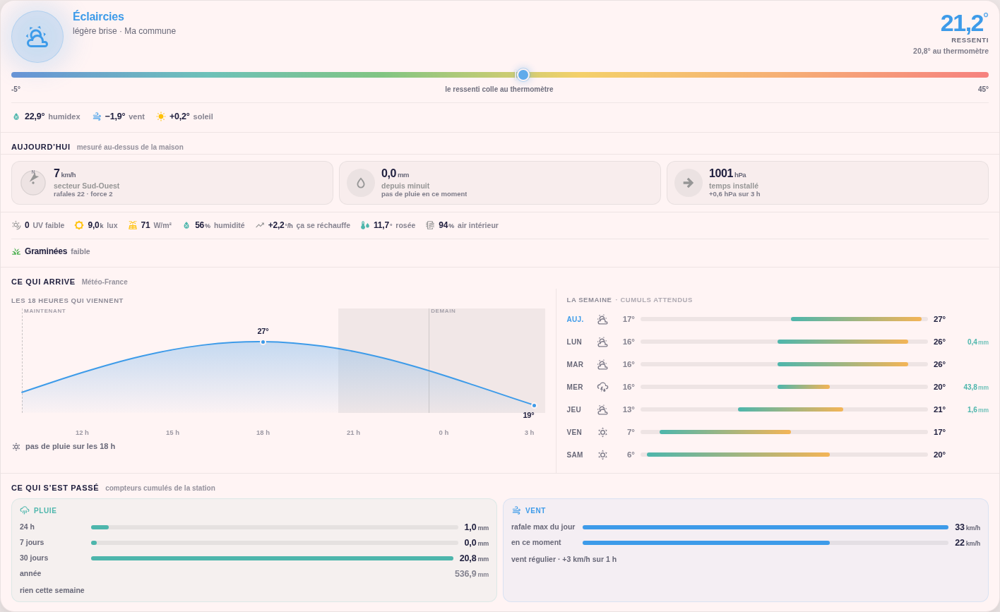

# Niak Weather

A Home Assistant weather dashboard combining an **Ecowitt station**, **Météo-France forecasts** and **Thermal Comfort humidex**.

[](https://my.home-assistant.io/redirect/hacs_repository/?owner=Niakman13&repository=niak-weather&category=plugin)

[Installation et mise à jour en français](docs/installation.md) · [Modèle et configuration](docs/data-model.md) · [Contrôles de fidélité](docs/parity.md)

## v0.2.0-beta.6 — original dashboard port

The renderer is mechanically ported from the original local YAML card, **not a visual approximation**. It keeps its MDI icons, animated halo and gauge, apparent-temperature breakdown, wind compass, daily rainfall, pressure trend, sensor/pollen rows, 18-hour curve, seven-day ranges and rain/wind summary. Compact and detailed views share the same renderer.

The calculation model is checked against golden results produced by the original Jinja template. Six browser comparisons (375/768/1440 px, light/dark) check both screenshots and component geometry against the original renderer with identical data and theme. These tests do **not** prove the appearance of every third-party Home Assistant theme or the availability of a user's live sensors.

This is a **pre-release** for testing in HACS; v0.1.0 remains the older stable preview.



Demonstration data and test theme; the card uses your Home Assistant theme. [Dark preview](docs/images/niak-weather-dark.png).

## Requirements

- Home Assistant 2025.1 or newer and [HACS](https://www.hacs.xyz/).
- [Météo-France](https://www.home-assistant.io/integrations/meteo_france/) configured with a `weather.*` entity for hourly/daily forecasts.
- [Ecowitt](https://www.home-assistant.io/integrations/ecowitt/) measurements. Any supported station/gateway is suitable; no GW2000-specific entity name is required. Missing optional sensors remain absent.
- [Thermal Comfort](https://github.com/dolezsa/thermal_comfort) configured using the station's **outdoor temperature and humidity** to provide humidex and its perception. Without humidex, the card explicitly labels its reduced thermometer-based estimate.
- `sun.sun` (normally provided by Home Assistant) for solar elevation and sunrise/sunset. A dedicated elevation sensor can replace the default.

No `button-card`, chart-card, card-mod or additional template package is needed to use the standalone card. Station entities can be prefilled using registry metadata and measurement names. Thermal Comfort selectors are filtered by metric/device; ambiguous setups require a manual choice and existing choices are preserved.

Lightning-distance sensors and Comfort/openings dependencies are removed for now. Forecast thunderstorms still appear; they are not presented as lightning measured at the station. The original green ventilation-benefit state is not invented without its source. Presentation/narratives currently follow the French local dashboard.

## Reusing an existing local template

Owners of the original local card can choose their existing weather-model and forecast sensors in **Soleil, air et compatibilité locale**. The card then reads their attributes directly, keeping the existing calculations/history instead of creating a competing model. Detection proposes these sensors only when the model's source station and weather entity match.

For other users, the same weather rules run in the card. Wind/pressure trends use Home Assistant Recorder history, not a few seconds of browser history. The actual available time window is displayed; missing history is not fabricated. Frontend calculations do not create Home Assistant sensors or automations.

## Install or update with HACS

Open the HACS button above, download **Niak Weather**, and reload the dashboard. If the repository is not found, add `https://github.com/Niakman13/niak-weather` to HACS custom repositories as **Dashboard**. For beta.6, enable pre-release versions or choose it in the repository's download/version dialog. The [French guide](docs/installation.md) includes setup, updating, the manual resource fallback and troubleshooting.

```yaml
type: custom:niak-weather-card
weather_entity: weather.ma_commune
temperature_entity: sensor.station_outdoor_temperature
humidity_entity: sensor.station_outdoor_humidity
humidex_entity: sensor.exterieur_humidex
wind_speed_entity: sensor.station_wind_speed
rain_rate_entity: sensor.station_rain_rate
daily_rain_entity: sensor.station_daily_rain
mode: detailed
```

Entity IDs above are examples. Prefer choosing actual entities in the visual editor.

## Development

```sh
npm ci
npm run validate
npx playwright install chromium
npm run test:browser
```

`npm run build` produces `dist/niak-weather-card.js`. Reference sources/golden fixtures are committed so CI does not depend on a developer's local dashboard or Python environment. See [parity.md](docs/parity.md) for regenerating references and the bounded validation report.

Published GitHub releases validate, run browser comparisons, then attach the installable JavaScript and source map. HACS updates the same resource; users do not need to rebuild anything.

MIT. See [LICENSE](LICENSE).
