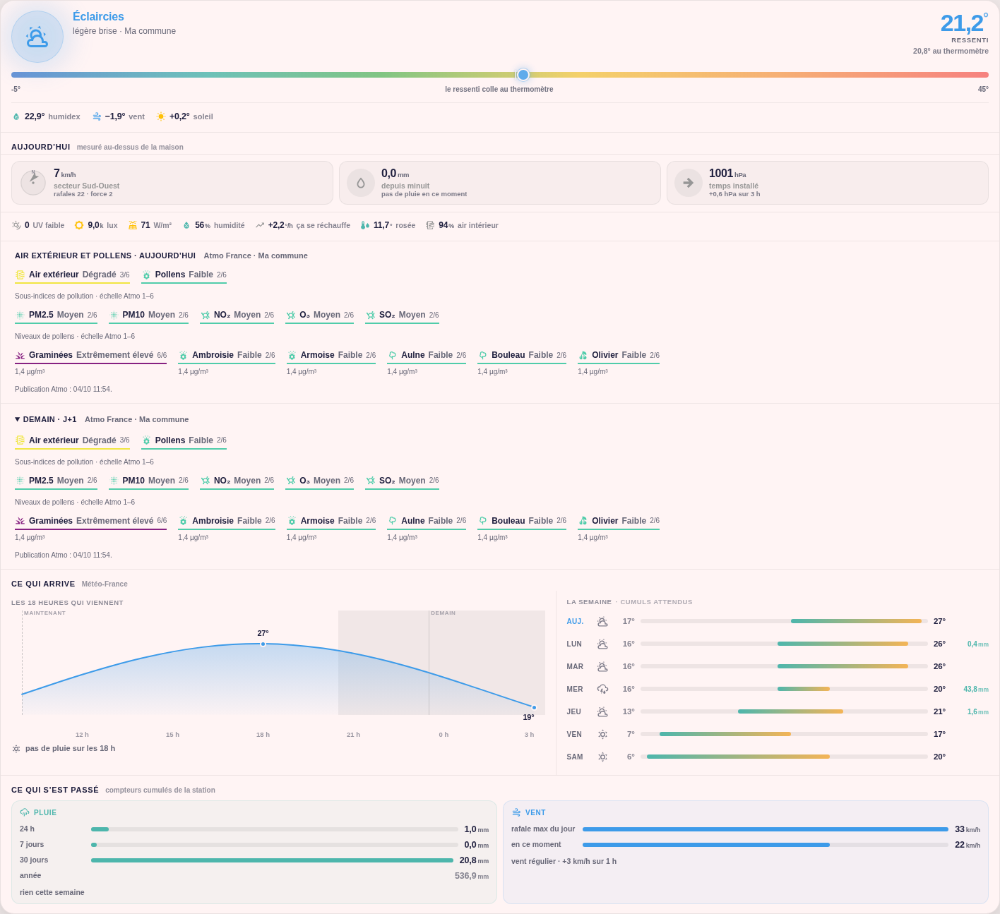

# Niak Weather

**Comprendre le temps qu’il fait chez vous, anticiper ce qui arrive et suivre ce qui est tombé.** Niak Weather rassemble dans une seule carte Home Assistant les mesures de votre station, les prévisions météo, un ressenti expliqué et les informations d’air extérieur et de pollens.

Une température seule ne raconte pas toute la météo : 25 °C à l’ombre, avec de l’humidité ou sous un vent soutenu, ne se vivent pas de la même façon. La carte donne du contexte aux chiffres et rapproche les observations de votre maison des prévisions de votre zone, sans les confondre.

**Version stable : v1.3.0.** La documentation principale et les textes de la carte sont en français.

La carte s’organise en **Synthèse, Aujourd’hui et Prévisions**. La synthèse intelligente est accompagnée de la météo actuelle et d’un ciel animé sur tout le bandeau : nuages, pluie, éclairs ou rafales. Le halo d’attention conserve sa signification, distincte de l’ambiance météo. Le ressenti expliqué, les indices air/pollens et les graphiques complètent cette lecture. [Nouveautés et mise à jour](docs/release-1.3.0.md) · [Météo actuelle et animations](docs/current-weather.md) · [Comprendre le brief et ses limites](docs/brief-intelligent.md).

[](https://my.home-assistant.io/redirect/hacs_repository/?owner=Niakman13&repository=niak-weather&category=plugin)

[Installation et mise à jour](docs/installation.md) · [Sources et prérequis](docs/sources.md) · [Atmo France : air et pollens](docs/atmo-france.md) · [Tous les réglages](docs/data-model.md)



Aperçu avec des données de démonstration ; le volet de demain est ouvert. La carte suit votre thème Home Assistant. [Aperçu météo en thème clair](docs/images/niak-weather-light.png) · [Aperçu en thème sombre](docs/images/niak-weather-dark.png).

## Ce que la carte apporte

Niak Weather organise la météo en trois lectures : **maintenant**, avec le ressenti et les mesures de la station ; **ce qui arrive**, avec l’évolution horaire et les prochains jours ; **ce qui s’est passé**, avec les cumuls de pluie et le bilan du vent. Vous pouvez ainsi repérer une hausse de température, l’arrivée d’une pluie ou une rafale marquante sans ouvrir plusieurs cartes.

La jauge compare le ressenti au thermomètre et en explique les principales contributions. La boussole situe le vent, le baromètre donne son évolution et les courbes permettent de lire les variations plutôt que des valeurs isolées. Les indices Atmo ajoutent une lecture de l’environnement extérieur, séparée de l’air intérieur.

Le mode **Complet** convient à une page météo détaillée ; **Accueil (compact)** garde une synthèse pour votre tableau de bord principal. Le rendu s’adapte à la largeur disponible et au thème Home Assistant.

Les prévisions affichent jusqu’à **18 heures et 7 jours**, selon les données réellement fournies. La carte distingue les conditions prévues pour la zone des mesures prises chez vous. Une mesure de station indisponible n’est pas remplacée par un zéro, et un orage prévu n’est pas présenté comme de la foudre détectée par la station.

L’éditeur peut préremplir les entités Ecowitt, Thermal Comfort et Atmo France. Il filtre les choix par station/appareil et par mesure ; Atmo est aussi filtré par commune et par jour. Les choix existants sont conservés et les correspondances ambiguës restent à choisir manuellement.

## Comment la carte interprète la météo

### Observer chez vous, prévoir pour votre zone

Météo-France fournit les conditions et prévisions de votre commune. Ecowitt apporte les observations à la maison. Pour l’état actuel, une pluie mesurée, des conditions compatibles avec un brouillard dense ou un fort rayonnement solaire peuvent prendre le pas sur le bulletin de la zone. **Cela ajuste la présentation du temps actuel, pas les prévisions du fournisseur.**

### Expliquer le ressenti

Le calcul part de l’**humidex extérieur** de Thermal Comfort, ou du thermomètre si l’humidex manque. Il ajoute les contributions estimées du vent, du rayonnement solaire, de la pluie et du ciel nocturne lorsque leurs données sont disponibles. La carte affiche le résultat, l’écart avec le thermomètre et les contributions, pour comprendre pourquoi l’atmosphère paraît plus chaude ou plus froide. Sans humidex, elle précise que l’humidité n’est pas comptée.

### Anticiper les prochaines heures et les prochains jours

La carte demande séparément les prévisions horaires et quotidiennes à votre entité météo, avec un renouvellement toutes les 15 minutes pendant qu’elle est affichée. Elle montre jusqu’à 18 points horaires et 7 jours, selon le fournisseur. La courbe représente les **températures prévues**, et non le ressenti calculé de la station ; elle comporte les extrema, les repères horaires, les périodes nocturnes et les précipitations annoncées. Les plages quotidiennes utilisent une échelle commune pour comparer les minimums et maximums d’un jour à l’autre.

La lecture horaire alimente aussi des phrases de synthèse : première pluie annoncée, accalmie pendant un épisode pluvieux, cumul attendu sur les prochaines heures ou orage prévu à court terme. Ces indications sont des interprétations des données reçues, pas de nouvelles prévisions ni une garantie d’heure exacte. **Niak Weather n’est pas un modèle de prévision météorologique indépendant.**

### Mettre les mesures en perspective

L’historique Home Assistant permet de qualifier l’évolution de la pression et du vent. Les compteurs de la station mettent la pluie du jour en perspective avec la semaine, le mois et l’année. Atmo France complète cette lecture avec ses indices quotidiens de zone et, si disponibles, ceux de demain. [Mécanique et réglages détaillés](docs/data-model.md).

## Prérequis : obligatoire ou facultatif ?

Le minimum est **Home Assistant 2025.1.0 ou plus récent** et une **entité `weather.*`**. Pour l’installation et les mises à jour recommandées, il faut également [HACS](https://www.hacs.xyz/). Le téléchargement manuel reste possible.

| Source ou composant | Statut | Ce qu’il apporte à la carte |
| --- | --- | --- |
| Entité météo, de préférence **Météo-France** | **Obligatoire** | Conditions de la zone, température de repli et prévisions disponibles. Météo-France est le fournisseur de référence. |
| **Ecowitt** | Facultatif pour démarrer ; nécessaire pour les mesures locales | Température et humidité extérieures, vent, pluie, pression et capteurs complémentaires. Pas de limitation à la GW2000 : station/passerelle prise en charge par l’intégration Home Assistant. |
| **Thermal Comfort** | Facultatif ; recommandé pour le ressenti complet | Humidex extérieur, perception et point de rosée de repli. Demande une température et une humidité extérieures. |
| **Soleil / `sun.sun`** | Facultatif ; recommandé, généralement déjà présent | Élévation solaire et lever/coucher pour les corrections de ressenti et les repères jour/nuit. |
| **Atmo France** | Facultatif | Air extérieur, sous-indices de polluants, niveaux et concentrations de pollens, aujourd’hui et demain. |
| **Polleninformation EU** | Facultatif ; alternative pour les pollens | Ligne d’espèces de pollens. Non affichée en double lorsque la source Atmo est sélectionnée. |
| **Indice d’air intérieur existant** | Facultatif | Pastille en %, indépendante d’Atmo. Il doit déjà être calculé par votre installation. |
| **Historique Recorder** | Facultatif ; nécessaire aux tendances intégrées | Évolution de la pression et du vent, sans créer de nouveaux capteurs. |

Le [guide des sources](docs/sources.md) explique pour chacune sa configuration, les entités utiles, ce qui apparaît à l’écran et ce qui manque lorsqu’elle n’est pas présente. Pour profiter des mesures et du ressenti enrichi, renseignez les capteurs Ecowitt disponibles, l’humidex extérieur et le Soleil ; ajoutez Atmo et l’air intérieur seulement si vous les souhaitez.

**Aucun `button-card`, chart-card, card-mod ou package de templates supplémentaire n’est nécessaire.** Node.js et les outils de développement ne sont pas requis chez les utilisateurs. Niak Weather ne configure pas les intégrations à votre place et ne demande aucun identifiant Atmo dans ses réglages.

## Installer avec HACS

1. Ouvrez le bouton HACS en haut de cette page. Il ouvre le dépôt, sans installer automatiquement la carte.
2. Si le dépôt n’est pas trouvé, ajoutez `https://github.com/Niakman13/niak-weather` dans **HACS → ⋮ → Dépôts personnalisés**, catégorie **Tableau de bord / Dashboard**. Il s’agit d’un dépôt personnalisé, pas d’un référencement dans le catalogue HACS par défaut.
3. Téléchargez **Niak Weather v1.3.0**, puis rechargez le navigateur.
4. Dans votre tableau de bord, choisissez **Ajouter une carte → Niak Weather** et sélectionnez votre entité météo.
5. Complétez **Entités de la station**, **Entités Thermal Comfort** et, si souhaité, **Atmo France — air extérieur et pollens**. Utilisez **Préremplir les entités manquantes**, puis vérifiez les propositions avant d’enregistrer.

Configuration minimale, sans station :

```yaml
type: custom:niak-weather-card
weather_entity: weather.ma_commune
mode: detailed
```

Exemple enrichi avec des mesures locales et l’humidex :

```yaml
type: custom:niak-weather-card
weather_entity: weather.ma_commune
temperature_entity: sensor.station_outdoor_temperature
humidity_entity: sensor.station_outdoor_humidity
humidex_entity: sensor.exterieur_humidex
wind_speed_entity: sensor.station_wind_speed
rain_rate_entity: sensor.station_rain_rate
daily_rain_entity: sensor.station_daily_rain
mode: detailed
```

Ces identifiants sont des **exemples**, pas des noms imposés. Privilégiez vos entités réelles dans l’éditeur. Le [tutoriel d’installation](docs/installation.md) détaille les ressources, les réglages et le dépannage.

## Mettre à jour vers v1.3.0

Dans **HACS → Niak Weather**, utilisez **Mettre à jour** ou **⋮ → Retélécharger** et sélectionnez **v1.3.0**. Il n’est pas nécessaire d’activer les préversions. Rechargez ensuite le navigateur avec **Ctrl+F5** ; sur mobile, videz le cache frontend si l’ancienne version reste affichée.

Les mises à jour utilisent la même ressource et conservent vos entités et réglages. Vous pouvez enrichir la configuration progressivement, sans recommencer l’installation. [Notes de version](docs/release-1.3.0.md).

## Limites et transparence

Le ressenti est une **estimation locale**, pas une mesure physiologique ni une vigilance officielle. Sans humidex, la carte signale que l’humidité n’est pas comptée. Les données Atmo décrivent la zone et ne remplacent ni une mesure d’air intérieur, ni un capteur dans le jardin. Les échelles Atmo, concentrations et pourcentages intérieurs ne sont pas mélangés.

La carte n’effectue pas de détection de foudre et ne pilote pas vos ouvrants. Les orages du ciel animé viennent de l’état actuel du fournisseur météo ; ceux du brief peuvent être annoncés par les prévisions. Ce ne sont pas des éclairs détectés sur place. Ses indicateurs ne remplacent ni la vigilance officielle ni les alertes de sécurité. Les calculs dans le navigateur ne créent pas d’entités Home Assistant pour les automatisations.

## Développement et vérifications

```sh
npm ci
npm run validate
npx playwright install chromium
npm run test:browser
```

`npm run build` produit `dist/niak-weather-card.js`. Les releases GitHub vérifient le code et le rendu, puis joignent le fichier installable et sa carte de sources. Les utilisateurs reçoivent les mises à jour par HACS sans compilation.

Les tests couvrent le ressenti, les conditions observées, les prévisions, les données manquantes, le préremplissage et les interactions. Des contrôles visuels à 375, 768 et 1440 px en clair/sombre détectent les régressions du rendu et les débordements. Ils utilisent des composants hôtes Home Assistant simulés : ils ne garantissent pas tous les thèmes tiers ni la disponibilité des capteurs de chaque installation. [Vérifications et limites](docs/parity.md).

Licence MIT — [LICENSE](LICENSE).
